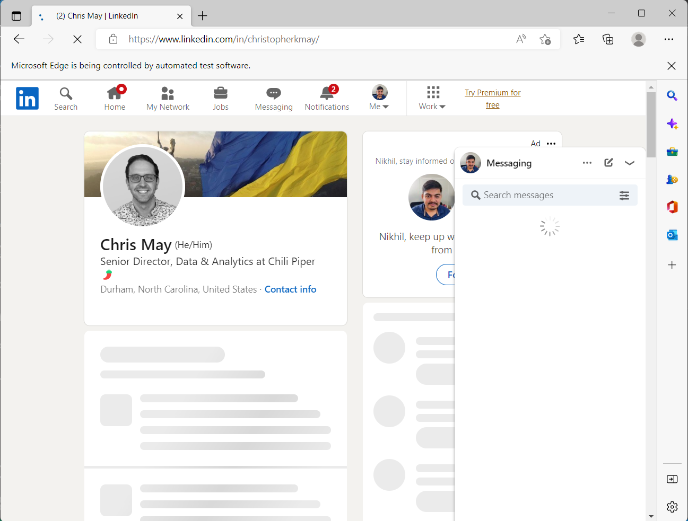

# Linkedin Scrapping Tool
> Get user info in csv file

This project gets linkedin url from [urls.txt](urls.txt) file, and scrap their
1. Personal info like Name, Date of Birth, Location, Email, Personal Website, Location
2. Experience
3. Skills
4. Education
5. Licence and Certification




## Installation

### Prerequisite
You need to have the following python packages
1. VS Code in Anacoda(For package ipynb)
2. Selenium 4.x.x
3. ipynb
4. python-dotenv
5. webdriver-manager

Command to install these 3 packages

```
pip install selenium ipynb python-dotenv webdriver-manager
```

### Browser
1. Edge Browser is needed for Windows
2. Chrome Browser is needed for Linux and Mac

## Setup

1. Fill up your linkedin user name and password in [.env](.env)
2. Fill up linkedin urls in [urls.txt](urls.txt), in line seperated format
3. Just execute ```python main.py```
4. Output will be stored in *output.csv* file in project folder

